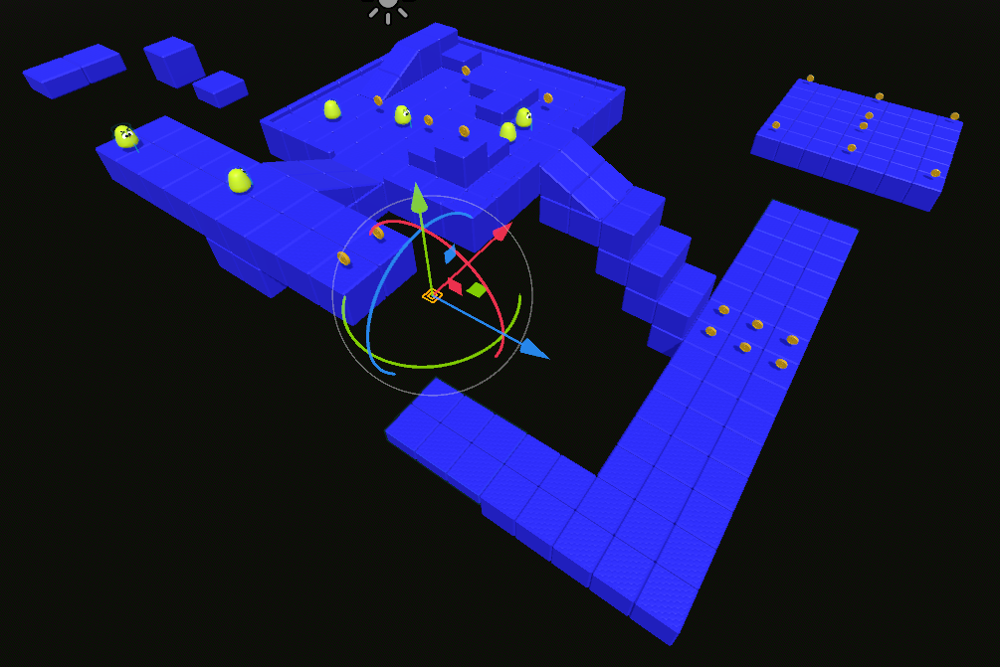
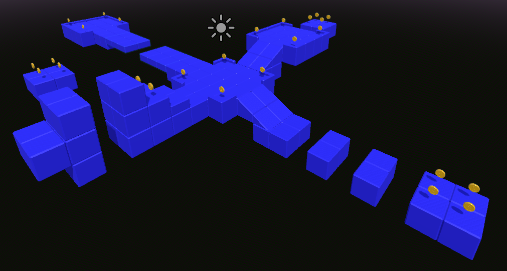
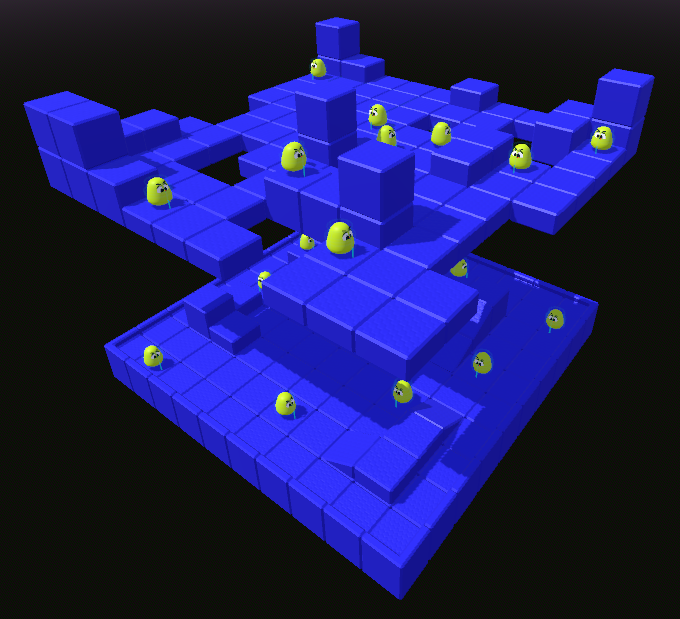

# 🎮 3D Platformer Game

    

A 3D platformer created with **Godot 4** and **Blender** as my first 3D game development project.

The goal of this project was to learn the fundamentals of 3D game development, including character movement, level design, enemy behavior, 3D modeling, texturing, and asset integration.

---

## 📖 About

This project began by following the excellent YouTube tutorial series **"Godot 4 Beginners: Learn to Make a 3D Platformer"** by **BornCG**, which teaches the complete process of creating a basic 3D platformer from scratch.

After finishing the tutorial, I continued expanding the project on my own by:

- Creating two additional levels
- Designing new gameplay challenges
- Improving the third-person camera using another tutorial
- Experimenting with textures and level design

The result is a small three-level platformer that combines everything I learned throughout the project.

---

## 🎮 Levels

### 🟢 Level 1 — Tutorial

The first level introduces the player to the core mechanics.

Features:

- Collect coins
- Defeat enemies
- Basic platforming
- Learn the controls

---

### 🟡 Level 2 — Parkour Challenge

A platforming-focused level where the objective is to collect every coin.

Features:

- Precision jumps
- Parkour sections
- Coin collection
- No enemies

---

### 🔴 Level 3 — Combat Challenge

The final level focuses entirely on defeating enemies.

Features:

- Enemy encounters
- Combat-focused gameplay
- No coin collection

---

## ✨ Features

- Third-person character controller
- Coin collection system
- Three different levels
- Blender-made assets
- Custom textures
- Background music
- HUD
- Simple level progression

---

## 🛠 Technologies

- Godot 4
- GDScript
- Blender
- Git
- GitHub

---

## 📚 What I Learned

Throughout this project I learned:

- Godot 4 fundamentals
- GDScript scripting
- CharacterBody3D
- Signals
- Raycasts
- Collision setup
- Scene organization
- Camera systems
- 3D modeling in Blender
- UV mapping
- Applying textures
- Exporting assets from Blender to Godot

---

## 🎓 Credits

This project was inspired by the following tutorials.

### Main Tutorial

**Godot 4 Beginners: Learn to Make a 3D Platformer**

Creator: **BornCG**

https://youtube.com/playlist?list=PLda3VoSoc_TTp8Ng3C57spnNkOw3Hm_35

---

### Camera Improvement

**Cómo crear una cámara en tercera persona y movimiento 3D en Godot**

Creator: **MadHat Studio**

https://youtu.be/d1y5WKjH7Yo

---

## 👨‍💻 Author

Jesús Sandoval

- GitHub: https://github.com/jesuSando
- LinkedIn: https://www.linkedin.com/in/jes%C3%BAs-orlando-sandoval-mart%C3%ADnez/
